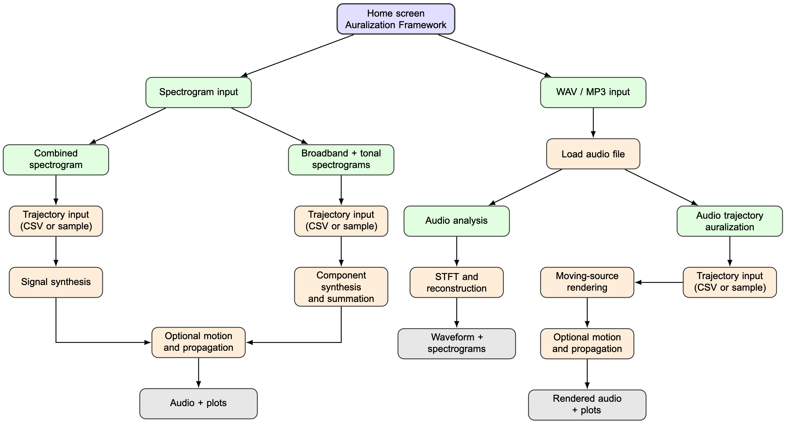

# Python Auralization Framework for Spectrogram Synthesis with Motion and Propagation

This repository contains a Python-based auralization framework with a graphical user interface for spectrogram synthesis with motion and propagation effects.

The tool was developed by **Ricardo Rocha** in the context of the **AE4439 Sustainable Air Transport Modelling Project** at **TU Delft**, under the supervision of **Dr. R. Merino Martínez**. Its purpose is to provide an accessible and flexible environment for interactive auralization, learning, and exploratory analysis of moving-source acoustic scenarios. 

The framework allows users to:
- load time-varying spectrogram data and synthesize an audio signal from it,
- work with either combined spectrograms or separate broadband and tonal inputs,
- include source and observer motion through time-dependent position data,
- optionally account for Doppler shift and simplified propagation effects,
- analyze WAV/MP3 files through STFT-based visualizations and reconstruction, and
- re-render existing audio files along prescribed trajectories.

The main goal of this repository is not to replace large-scale or high-fidelity aircraft-noise simulation frameworks. Instead, it is intended as a lightweight, transparent, and user-friendly tool for rapid auralization, perceptual exploration, and teaching.

---

## Workflow Figure

A simplified workflow of the framework is shown below.



---

## Main Features

### 1. Spectrogram-driven auralization
The tool can synthesize a time-domain signal from:
- a single combined spectrogram, or
- two separate spectrograms representing broadband and tonal components.

### 2. Moving source and observer
The user may provide a trajectory CSV file describing:
- source position,
- observer position,
- time evolution.

The tool interpolates these positions and estimates velocities to apply motion-related effects.

### 3. Simplified physics modules
Optional physical effects currently implemented include:
- Doppler shift,
- motion-dependent amplitude variation,
- geometric spreading,
- atmospheric absorption,
- ground reflection through a mirrored-source approximation.

### 4. Audio analysis mode
A WAV or MP3 file can be loaded and analyzed through:
- waveform display,
- magnitude spectrogram,
- phase spectrogram,
- phase-preserving reconstruction,
- Griffin–Lim magnitude-only reconstruction.

### 5. Audio trajectory auralization
An existing WAV or MP3 file can also be treated as the emitted source signal and re-rendered along:
- a user-defined trajectory, or
- a generated sample trajectory.

### 6. Built-in sample trajectories
The GUI can generate example source-observer scenarios such as:
- takeoff,
- overfly,
- landing,
- cosine-varying altitude,
- wind-turbine-tip motion.

### 7. Interactive playback visualization
During playback, the GUI shows:
- a moving cursor through the waveform or spectrogram,
- synchronized source-observer motion in the 3D plot for motion-enabled modes.

---

## Repository Structure

```text
├── README.md
├── requirements.txt
├── GUI.py
├── auralization.py
└── docs/
    └── images/
        └── tool_workflow.png
```
---

## Input Formats

### Spectrogram CSV
The spectrogram input is expected to follow this structure:
- first column: frequencies,
- header row: times,
- remaining entries: SPL values.

### Positions CSV
The trajectory file is expected to contain the columns:

time, emitter_x, emitter_y, emitter_z, observer_x, observer_y, observer_z

---

## Installation

### 1. Clone the repository

```bash 
git clone https://github.com/PALILA-TUDelft/Auralization-standalone
cd Auralization-standalone
```

### 2. Create a virtual environment

#### Windows
```bash 
python -m venv .venv
.venv\Scripts\activate
```
#### macOS / Linux
```bash 
python3 -m venv .venv
source .venv/bin/activate
```
### 3. Install dependencies
```bash 
pip install --upgrade pip
pip install -r requirements.txt
```
---

## How to Run

Start the graphical interface with:
```bash 
python GUI.py
```
This opens the auralization framework GUI.

---

## How the Current Tool Works

The current implementation is organized around two main branches.

### A. Spectrogram input branch
The user can:
- load a combined spectrogram, or
- load separate broadband and tonal spectrograms,
- optionally load a positions CSV or generate a sample trajectory,
- choose sampling rate and FFT size,
- enable or disable Doppler and simplified propagation,
- synthesize and listen to the resulting signal.

### B. WAV / MP3 input branch
The user can:
- analyze an existing audio file using STFT-based visualizations,
- compare original, phase-preserving, and magnitude-only reconstructions,
- use the same audio file as a moving emitted source,
- render it along a trajectory with optional Doppler and propagation.

---

## Current Scope

This repository currently provides a lightweight and interactive framework for:
- perceptual exploration,
- educational demonstration,
- early-stage research prototyping.

The implementation is intentionally simplified in some aspects. In particular:
- the propagation model is approximate,
- the spectrogram-based synthesis uses random phase assignment,
- the audio trajectory rendering is a simplified moving-source implementation,
- the built-in trajectories are intended mainly for demonstration and testing.

These limitations are acceptable within the intended purpose of the current framework.

---

## Contact

For questions, suggestions, or collaboration, please contact:

**Ricardo Rocha**  
rmoraisdarocha@tudelft.nl

**Dr. R. Merino-Martínez**  
R.MerinoMartinez@tudelft.nl

If any bug is found, opening an issue on GitHub is also encouraged.
